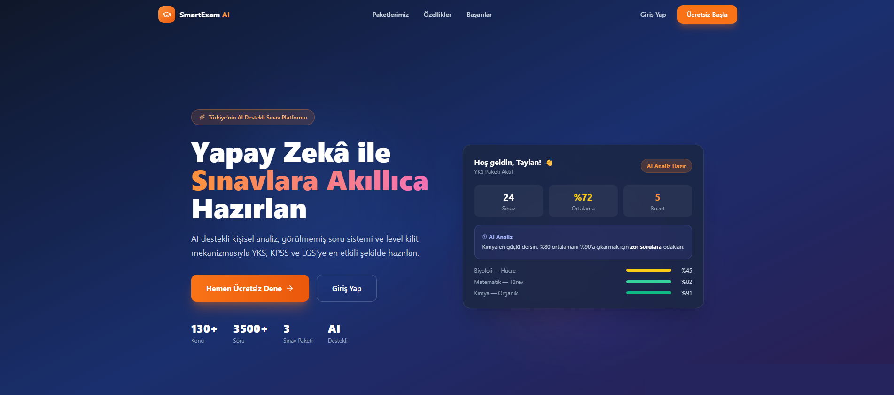
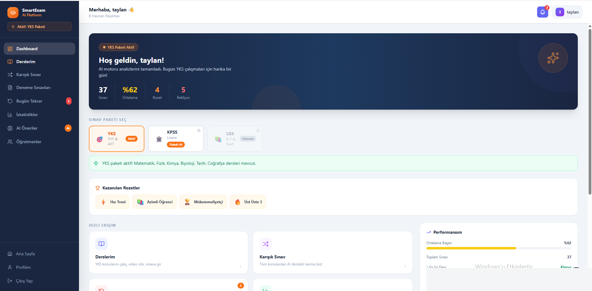
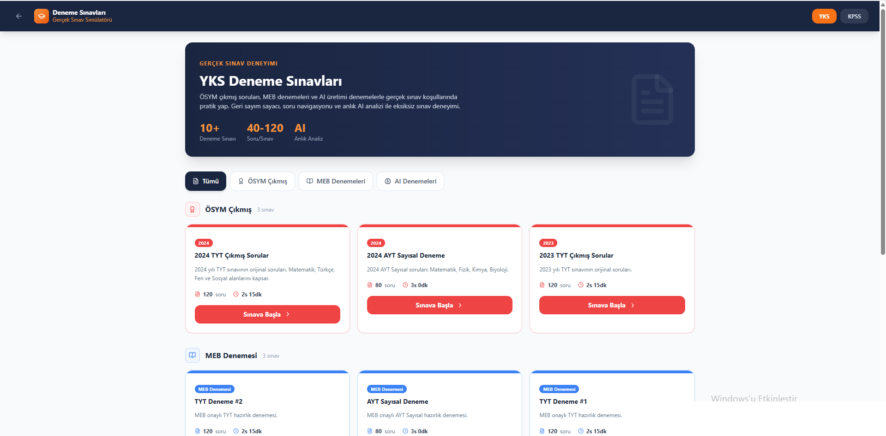
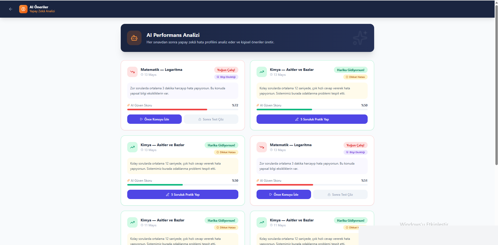
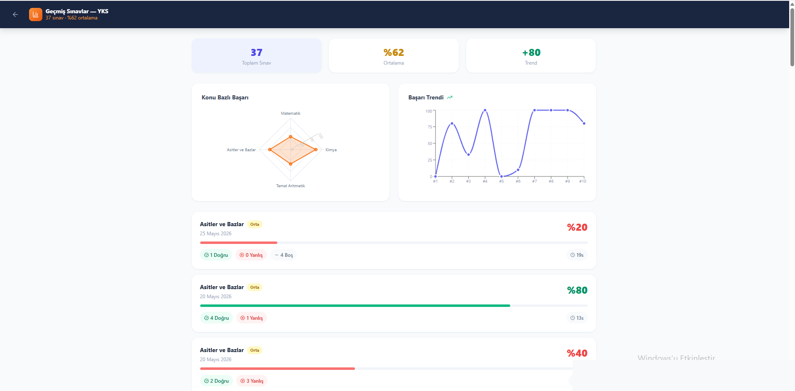

# SmartExam — Yapay Zeka Destekli Sınav Hazırlık Platformu

> YKS ve KPSS'ye hazırlanan öğrenciler için kişiselleştirilmiş, yapay zeka destekli web tabanlı öğrenme platformu.  
> Süleyman Demirel Üniversitesi Bilgisayar Mühendisliği Bitirme Tezi — 2026

**Canlı Demo:** [smartexam-tr.vercel.app](https://smartexam-tr.vercel.app)

---

## Özellikler

- **Çok Rol Sistemi** — Öğrenci, öğretmen ve veli panelleri
- **Deneme Sınavı Modülü** — Gerçek zamanlı sınav, otomatik puanlama ve detaylı analiz
- **Yapay Zeka Soru Açıklama** — Google Gemini 2.5 Flash ile Türkçe pedagojik açıklamalar
- **Aralıklı Tekrar (Spaced Repetition)** — Ebbinghaus unutma eğrisi tabanlı kişiselleştirilmiş çalışma planı
- **Ders İçeriği Yönetimi** — Video, PDF ve test materyali paylaşımı
- **JWT Kimlik Doğrulama** — Rol tabanlı güvenli erişim kontrolü

---

## Teknoloji Yığını

| Katman | Teknoloji |
|--------|-----------|
| Backend | Java Spring Boot 3.5, Spring Security, JPA/Hibernate |
| Frontend | React 18, Tailwind CSS, Lucide Icons |
| Veritabanı | PostgreSQL 17 |
| AI Servisi | Python Flask, Google Gemini 2.5 Flash (`google-genai`) |
| Auth | JWT (JSON Web Token) |
| Deploy | Render.com (backend + AI), Vercel (frontend) |
| Container | Docker (multi-stage build) |

---

## Mimari

```
┌─────────────────┐     HTTPS      ┌──────────────────┐
│  React Frontend │ ─────────────► │  Spring Boot API │
│  (Vercel)       │                │  (Render.com)    │
└─────────────────┘                └────────┬─────────┘
                                            │
                              ┌─────────────┼─────────────┐
                              │             │             │
                    ┌─────────▼──┐  ┌───────▼──┐  ┌──────▼──────┐
                    │ PostgreSQL │  │  Flask   │  │   JWT Auth  │
                    │    DB      │  │ AI Servis│  │             │
                    └────────────┘  └──────────┘  └─────────────┘
                                         │
                                  ┌──────▼──────┐
                                  │   Gemini    │
                                  │ 2.5 Flash   │
                                  └─────────────┘
```

---

## Kurulum (Yerel Geliştirme)

### Gereksinimler
- Java 17+, Maven
- Node.js 18+
- Python 3.11+
- PostgreSQL 17

### Backend
```bash
cd platform
# application.properties içinde DB bilgilerini gir
mvn spring-boot:run
```

### Frontend
```bash
cd frontend
npm install
npm start
```

### AI Servisi
```bash
cd ai-service
pip install -r requirements.txt
GEMINI_API_KEY=your_key python app.py
```

---

## Veri

- 4.260 soru (YKS/KPSS müfredatı)
- 12 ders, 135 ders içeriği
- 13 deneme sınavı

---

## Ekran Görüntüleri

### Ana Sayfa


### Öğrenci Paneli (Dashboard)


### Deneme Sınavları


### AI Öneriler & Performans Analizi


### İstatistikler & Geçmiş Sınavlar


---

## Lisans

Bu proje Süleyman Demirel Üniversitesi bitirme tezi kapsamında geliştirilmiştir.

---

**Geliştirici:** Taylan Karay  
**İletişim:** taylankaray@gmail.com  
**LinkedIn:** [linkedin.com/in/taylan-karay-348a60370](https://www.linkedin.com/in/taylan-karay-348a60370/)
